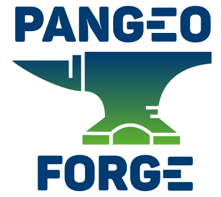
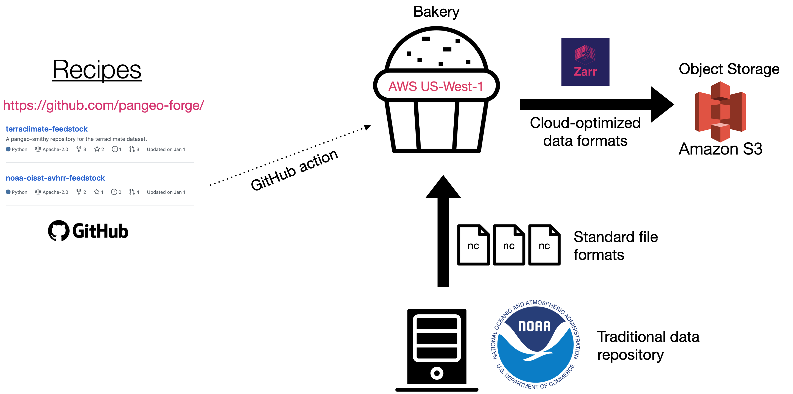

# Pangeo Forge public roadmap

In this repository, you can find the the Pangeo Forge project roadmap.
The roadmap is where you can learn about Pangeo Forge project, its subprojects, how they fit together, and the road ahead.
Pangeo Forge is just getting started so please open [issues](https://github.com/pangeo-forge/roadmap/issues) to ask questions or to propose changes and/or additions to the roadmap itself.
Pangeo Forge has grown out of the [Pangeo Project](http://pangeo.io/), an open-source community promoting open, reproducible, and scalable science. 

## Inspiration

Pangeo Forge is inspired to copy the very successful pattern of [Conda Forge](https://conda-forge.org/).
Conda Forge makes it easy for anyone to create a [conda package](https://docs.conda.io/projects/conda/en/latest/user-guide/concepts/packages.html), a binary software package that can be installed with the conda package manager.
In Conda Forge, a maintainer contributes [a recipe](https://conda-forge.org/#add_recipe) which is used to generate a conda package from a source code tarball. Behind the scenes, CI downloads the source code, builds the package, and uploads it to a repository.
By automating the difficult parts of package creation, Conda Forge has enabled the open-source community to collaboratively maintain a huge and dynamic library of software packages.

## Vision

Pangeo Forge aspires to be like Conda Forge, but for data--specifically, Analysis Ready, Cloud Optimized (ARCO) data.
(For a detailed working definiton of ARCO data, see our paper [Cloud Native Repositories for Big Scientific Data](https://ieeexplore.ieee.org/abstract/document/9354557).)
We envision a vibrant, dynamic library of open-access ARCO data stored in public clouds, shared among thousands of scientists and directly accessible to data-proximate computing.
However, manually populating such a library would be prohibitively difficult and tedious.
Instead, we are building Pangeo Forge to automate the production of ARCO data and enable the croudsourcing of such a data library.

In Pangeo Forge, a maintainer contributes a recipe which is used to generate an analysis-ready cloud-based copy of a dataset in a cloud-optimized format like Zarr. Behind the scenes, Pangeo Forge cloud-based automation downloads the original files from their source (e.g. FTP, HTTP, or OpenDAP), combines them into one coherent dataset (e.g. using xarray), and writes the data in a cloud optimized format (e.g. Zarr) to cloud storage in a streaming fashion.

## Technical Concepts and Architecture

:exclamation: **Warning!** Pangeo Forge doesn't actually "work" yet. The integration and development of these compoments is work in progress.

### Recipes

A recipe defines how to transform data in one format / location into another format / location.
The primary way people contribute to Pangeo Forge is by writing / maintaining recipes.
Recipes are python objects generated by the [pangeo_forge](https://pangeo-forge.readthedocs.io/en/latest/) package.
These recipes can be used in a standalone fashion, without integration with the Pangeo Forge cloud automation infrastructure.
Or they can be turned into feedstocks and become part of the library.

### Feedstocks

Feedstocks are recipes that are managed and executed by Pangeo Forge cloud automation.
Feedstocks are stored in GitHub repositories in the [pangeo-forge GitHub organization](https://github.com/pangeo-forge/).
The community develops and maintains recipes through interaction with these repositories.

### Bakeries

Bakeries turn recipes into data.
They do the heavy lifting of actually executing the recipes: extracting data from its source, transforming it, and loading it into its target destination.
Bakeries are controlled by triggers from GitHub workflows.
Bakeries can run in cloud or on-premises compute nodes; they should be placed in close network proximity to data sources and / or targets.
We hope that eventually there will be Pangeo Forge bakeries running in most regions of major cloud providers.

## Subprojects

Pangeo Forge brings together a number of smaller subprojects to implement this vision.
The currently-active subprojects are

### 01 - `pangeo-forge-recipes`

<https://github.com/pangeo-forge/pangeo-forge>

The `pangeo_forge` python package provides the core API for creating Recipes.
All of the "business logic" for how to extract, transform, and load data lives in this library; as such, it is the focal point of Pangeo Forge development.

### 02 - `meta-yaml-spec`

### 03 - `pangeo-forge-runner`

### 04 - Github Action

Bakery deployments are being developed for specific cloud providers.

- <https://github.com/pangeo-forge/pangeo-forge-aws-bakery>

### 05 - Github App

### 06 - Pangeo Forge Website

<https://github.com/pangeo-forge/pangeo-forge-vue-website>

Once the system is operating, the data library catalog will be viewable on this vue.js website.
However, we aren't quite ready for this front-end work yet.

## Milestones

Here we outline some rough milestones we hope to meet.

| Date | Features | KPIs | 
|------|----------|------|
| May 1, 2021 | Launch cloud automation | - | 
| Nov 1, 2021 | Launch catalog website | Functional recipes from partners GHRSST & iHESP; 20 active users |
| May 1, 2022 | Launch JupyterHub / Binder integration | Functional recipes from partners ECMWF (ERA5) and ESGF (CMIP6); 20 user-contributed recipes; 100 active users |
| May 1, 2023 | - | 100 user-contributed recipes; 500 active users |

## Contributing

Pangeo-forge is just getting started. There's lots of work to do and lots of room for contributors to engage.
Overall progress on the project can be tracked via two project boards:
- The [Recipe Implementation project board](https://github.com/pangeo-forge/staged-recipes/projects/1).
  This tracks the progress of implementing the recipes outlined in staged-recipes.
- The [software development project board](https://github.com/orgs/pangeo-forge/projects/1) shows the progress of the `pangeo_forge` python package, defines what sort of recipes Pangeo Forge can support.

At this stage, there are a few ways you may consider getting involved.

1. Scientists and data managers can [document an example recipe](https://github.com/pangeo-forge/staged-recipes/issues/new?assignees=&labels=example&template=example-pipeline.md&title=Example+pipeline+for+%5BDataset+Name%5D). Gathering use cases very helpful for defining the technical needs of pangeo-forge. You don't have to write any code to do this; you just have to understand the dataset you want to work with.
2. Python software developers can contribute to the code base. The [software development project board](https://github.com/orgs/pangeo-forge/projects/1) is a great place to start.
3. Anyone can comment on the project road map in this repository.
4. Eventually (but not yet), organizations can provide support for operating the bakeries (or run their own).

------

This work is licensed under <a rel="license" href="https://creativecommons.org/licenses/by/4.0">CC BY 4.0</a>.

